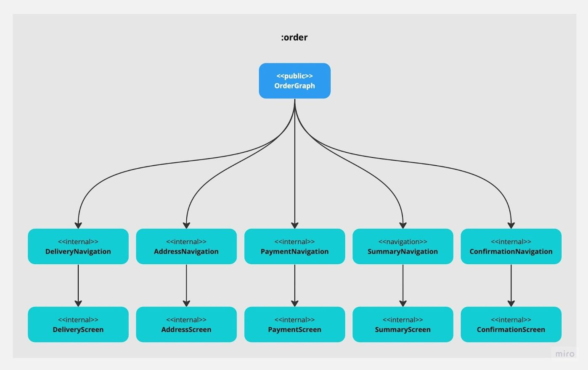
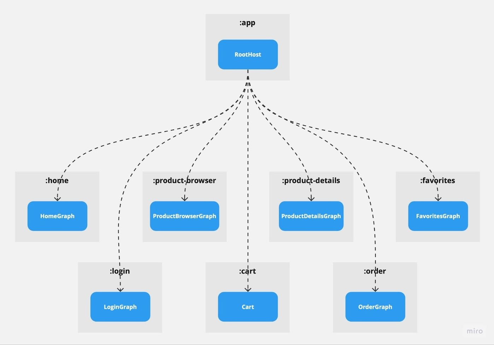

# Implementing navigation

### 📖 Articles

- [Navigation](https://developer.android.com/guide/navigation)
- [Navigation with Compose](https://developer.android.com/jetpack/compose/navigation)
- [Type safety in Kotlin DSL and Navigation Compose](https://developer.android.com/guide/navigation/design/type-safety)

### 🎬 Videos

- [Type safe, multi-module best practices with Navigation Compose](https://www.youtube.com/watch?v=goFpG25uoc8)

## Navigation extensions

When we build navigation we split our app into screens. 
Each screen has its own composable function, UI state, view model and navigation extensions. 

### 💚 Keep screen independent of the ViewModel and NavController

Screen composable as well as all its children should not have direct access to the ViewModel or NavController. 
Instead, they should accept states and event lambdas as parameters.

```kotlin
@Composable
fun ProfileScreen(
    // Screen accepts only data and lambdas
    state: ProfileUiState,
    onRefresh: () -> Unit,
    onNavigateBack: () -> Unit,
    onNavigateToChangePassword: () -> Unit,
    onNavigateToDeleteAccount: () -> Unit,
) {
    // ...
}
```

### 💚 Create navigation extensions for each screen

For each screen you should create a separate file with navigation extensions.
First extension extends `NavController` and allows us to navigate to the screen.
Second extension extends `NavGraphBuilder` and allows us to add the screen to the navigation graph.

```kotlin
// ProfileNavigation.kt

// Keep arguments and route as constants
private const val PROFILE_ID = "profileId"
const val PROFILE_ROUTE = "profile/{$PROFILE_ID}"

// Extension which allows us to navigate to the screen
fun NavController.navigateToProfile(profileId: String) {
    PROFILE_ROUTE
        .replace("{$PROFILE_ID}", profileId)
        .let { navigate(it) }
}

// Extension which allows us to add the screen to the navigation graph
fun NavGraphBuilder.profileScreen(
    onNavigateBack: () -> Unit,
    onNavigateToChangePassword: () -> Unit,
    onNavigateToDeleteAccount: () -> Unit,
) {
    composable(route = PROFILE_ROUTE) {
        val viewModel: ProfileViewModel = hiltViewModel()
        val state by viewModel.state.collectAsStateWithLifecycle()
        
        ProfileScreen(
            state = state,
            // Events invoking business operations are delegated to the ViewModel
            onRefresh = { viewModel.refresh() },
            // Events invoking navigation are delegated to the parent composable
            onNavigateBack = onNavigateBack,
            onNavigateToChangePassword = onNavigateToChangePassword,
            onNavigateToDeleteAccount = onNavigateToDeleteAccount,
        )
    }
}
```

### 💚 Create navigation graph using navigation extensions

In the `NavHost` composable we define a navigation graph using the navigation extensions which we created for each screen.

```kotlin
@Composable
fun MainNavHost() {
    val navController = rememberNavController()
    
    NavHost(
        navController = navController,
        // Set start destination using constants
        startDestination = HOME_ROUTE,
    ) {
        // Add screens to the navigation graph using navigation extensions
        homeScreen(
            // Handle navigation events by calling the navigation extensions
            onNavigateToProfile = { profileId -> navController.navigateToProfile(profileId) },
        )
        profileScreen(
            onNavigateBack = { navController.popBackStack() },
            onNavigateToChangePassword = { navController.navigateToChangePassword() },
            onNavigateToDeleteAccount = { navController.navigateToDeleteAccount() },
        )
        changePasswordScreen(
            onNavigateBack = { navController.popBackStack() },
        )
        deleteAccountScreen(
            onNavigateBack = { navController.popBackStack() },
        )
    }
}
```

### 💔 Don't pass the `NavController` to the navigation extensions

In previous example each `NavGraphBuilder` extension accepts lambdas which represent navigation events.
This way the navigation graph becomes a Single Source of Truth about the navigation flow.

An alternative solution is to pass the `NavController` to the navigation extensions and use it to navigate between screens.
This approach is not recommended because:

- It couples one screen with other screens as it has to use their navigation extensions.
- It makes the navigation graph harder to understand as it's not so clear how user moves between screens.

```kotlin
@Composable
fun MainNavHost() {
    val navController = rememberNavController()
    
    NavHost(
        navController = navController,
        startDestination = HOME_ROUTE,
    ) {
        // Now it is not so clear how user moves between screens
        homeScreen(navController)
        profileScreen(navController)
        changePasswordScreen(navController)
        deleteAccountScreen(navController)
    }
}
```

### 💔 Don't create GOD sealed class for navigation events

In previous example we used lambdas to represent navigation events. 
Each screen exposed its own events without being dependent on anything else.

An alternative solution is to create a single sealed class which represents all navigation events in the app.
This approach is not recommended because:

- This kind of sealed class will grow indefinitely as the app grows, and it will become hard to maintain.
- When you split your app into modules, all your modules which contain screens have to depend on the same module which contains this sealed class.

```kotlin
// This class will grow indefinitely, it will become hard to maintain 
// and problematic in multi-module projects
sealed class NavigationEvent {

    data object NavigateBack : NavigationEvent()

    data class NavigateToProfile(val profileId: String) : NavigationEvent()

    data object NavigateToChangePassword : NavigationEvent()
    
    data object NavigateToDeleteAccount : NavigationEvent()
}
``` 

## Nested graphs

When we build navigation we split our app into features. 
Each feature represents some separate business flow with its own screens.

### 💚 Create a nested graph for each feature

For each feature you should create a separate file with a nested graph.
Nested graphs allow us to split the `NavHost` into smaller logical flows.
We define the nested graph by creating navigation extensions, similar to the ones we created for screens.
    
```kotlin
// OrderGraph.kt

// Same as screen, each nested graph has its own route
const val ORDER_GRAPH_ROUTE = "order-graph"

// We navigate to the nested graph same as to the screen, using the route
fun NavController.navigateToOrderGraph() {
    navigate(ORDER_GRAPH_ROUTE)
}

fun NavGraphBuilder.orderGraph(
    // Unlike the screen, nested graph accepts the NavController as parameter.
    // We use it to perform internal navigation between screens in this flow.
    navController: NavController,
    // If we want to navigate to the screen which is outside of this flow,
    // we expose navigation events, same as for the screen
    onExitOrder: () -> Unit,
    onNavigateToProduct: (String) -> Unit
) {
    navigation(
        route = ORDER_GRAPH_ROUTE,
        startDestination = DELIVERY_ROUTE
    ) {
        // We add screens the same as to the NavHost
        deliveryScreen(
            // We use the NavController to navigate between screens in this flow
            onNavigateBack = { navController.popBackStack() },
            onNavigateToAddress = { navController.navigateToAddress() },
        )
        addressScreen(
            onNavigateBack = { navController.popBackStack() },
            onNavigateToPayment = { navController.navigateToPayment() },
            // We use navigation events to navigate outside of this flow
            onExitOrder = onExitOrder,
        )
        paymentScreen(...)
        summaryScreen(...)
        confirmationScreen(...)
    }
}
```

### 💚 Each nested graph can be a separate module

In larger projects it is a good approach to split the app into modules. 
Each features with its own screens and nested graphs can be a separate module.
Screens, UI states, view models and navigation extensions are kept `internal`.
Nested graph is the only `public` API of the feature module.





### 💚 `NavHost` only aggregates nested graphs

When our navigation is properly split into nested graphs the `NavHost` composable becomes very simple.
It only aggregates the nested graphs using their navigation extensions.
It also handles navigation events exposed by these graphs and moves user to different graphs.

```kotlin
@Composable
fun MainNavHost() {
    val navCollection = rememberNavController()
    
    NavHost(
        navController = navController,
        // One of the nested graphs is set as the start destination
        startDestination = HOME_GRAP_ROUTE,
    ) {
        homeGraph(
            // We pass the NavController to the nested graph, 
            // so it can perform internal navigation
            navController = navController,
            // We handle navigation events exposed by the nested graph 
            // and move user to different graphs
            oNavigateToProduct = { productId -> navController.navigateToProduct(productId) },
        )
        cartGraph(...)
        orderGraph(...)
        productGraph(...)
    }
}
```

## Navigation arguments

Some screens require additional data to be passed when we navigate to them.

### 💚 Create a wrapper class for navigation arguments

When we pass navigation arguments between screens they are saved to the `SavedStateHandle` object.
This object keeps all the data as `Any` type, so we have to cast it to the proper type when we read it.
It is a good practice to create a separate wrapper for the navigation arguments which will handle the casting.
We put it in the same file as the navigation extensions.

```kotlin
data class ProfileArgs(val profileId: String) {
    constructor(savedStateHandle: SavedStateHandle) : this(
        profileId = checkNotNull(savedStateHandle[PROFILE_ID]) 
    )
}
```

```kotlin
class ProfileViewModel(
    savedStateHandle: SavedStateHandle
) {
    
    private val args = ProfileArgs(savedStateHandle)
}
```

### 💔 Don't pass objects as navigation arguments

Unlike the navigation for Fragments and Activities, navigation for Compose doesn't support passing `Serializable` and `Parcelable` objects as navigation arguments.
It is an intentional decision as passing whole objects between screens is considered as a bad practice due several reasons:

- Max size of the navigation arguments is limited and can cause runtime exceptions.
- Passing whole objects is not reactive as we can't observe their changes.
- The more data we pass between screens, the more tightly coupled they become.

```kotlin
// Don't pass whole objects as navigation arguments
// It is enough to pass only the ID of the object
// Let the screen load all the data it needs from the repository
fun NavController.navigateToProduct(product: Product) {
    // ...
}
```

## Dialogs and bottom sheets

Compose navigation allows us to navigate not only between screens, but also to dialogs and bottom sheets.

### 💚 Create navigation extensions for dialogs

Same as for screens, we create navigation extensions for dialogs.
We can use both standard dialogs and full screen dialogs.

```kotlin
fun NavGraphBuilder.changePasswordDialog() {
    dialog(
        route = CHANGE_PASSWORD_ROUTE,
        // This way we make the dialog full screen
        dialogProperties = DialogProperties(usePlatformDefaultWidth = false)
    ) {
        // ...
    }
}
```

### 💚 Create navigation extensions for bottom sheets

Same as for screens, we create navigation extensions for bottom sheets.
Support for bottom sheets is still experimental and requires [additional dependency](https://google.github.io/accompanist/navigation-material/).

```kotlin
fun NavGraphBuilder.deleteAccountBottomSheet() {
    bottomSheet(route = DELETE_ACCOUNT_ROUTE) {
        // ...
    }
}
```

## Deeplinks

Deeplinks allow us to navigate to a specific screen in the app using a URL.

### 💚 You can use existing routes as deeplinks

As our navigation is already defined using routes, we can easily use the same routes as deeplinks.

```kotlin
// Define the base deeplink for the app
const val BASE_DEEPLINK = "app://com.droidsonroids.playground/"
```

```kotlin
fun NavGraphBuilder.forgotPasswordScreen() {
    composable(
        route = FORGOT_PASSWORD_ROUTE,
        // Just add deeplinks to the screen and Compose navigation will handle the rest
        deepLinks = listOf(
            navDeeplink { uriPattern = BASE_DEEPLINK + FORGOT_PASSWORD_ROUTE }
        )
    ) {
        // ...
    }
}
```
